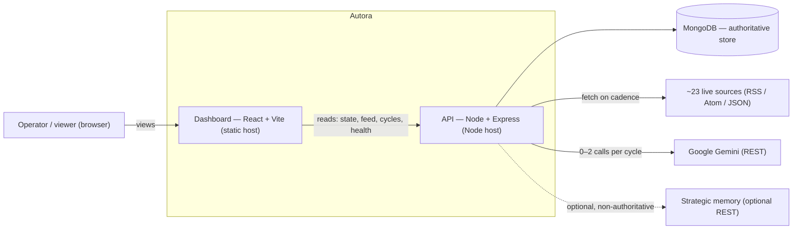

# Architecture — Autora

> System architecture and design decisions for **Autora**, the autonomous AI creator.

This document explains *how Autora is built and why it is built that way*. It is the design-level
companion to two other documents:

- [README.md](README.md) — what Autora is, why it isn't a chatbot, and how to run it.
- [PROJECT_HANDOFF.md](PROJECT_HANDOFF.md) — the phase-by-phase build record, verified against the
  repository at each step.

Where the README answers *what* and *how do I run it*, this document answers *how is it
structured*, *where are the boundaries*, and *why those boundaries*. It is deliberately
implementation-agnostic about line-level detail — for the exact build history, see the handoff.

---

## 1. What Autora is, architecturally

Autora is an **autonomous agent**: it is initialized once, and from then on a background worker
runs it on its own schedule with no human prompt between cycles. Each cycle it discovers topics
from live sources, decides on its own whether anything is worth publishing, optionally writes one
post, persists the result, and records what it did so the next cycle behaves differently.

The engineering value is not text generation — LLMs do that on demand. It is the machinery
*around* generation: deciding **when** to run, **what** is worth covering, **whether** to publish
at all, and **not repeating** past work — reliably, unattended, and without spending API quota on
every cycle. That machinery is what this document describes.

Two properties shape almost every structural decision below:

1. **Deterministic work comes before any model call.** Fetching, filtering, dedupe, ranking, and
   the memory gate are plain code. The LLM is reached only after the cheap work has narrowed the
   field — so a cycle with nothing new to say costs **zero** model calls.
2. **The LLM budget is a hard invariant: 0, 1, or 2 calls per cycle.** Call #1 is the editorial
   decision; call #2 is generation, and only on the publish path. Token spend per cycle is bounded
   by design, not by luck.

---

## 2. System context

Autora deploys as **two independent services** talking to a small set of external systems.



- **Dashboard** — a read-only React SPA. It only *reads* what the backend already produced; it
  never triggers content generation.
- **API** — a Node/Express process that hosts both the HTTP surface *and* the autonomous
  scheduler. The scheduler is in-process, not a separate worker service (see §11).
- **MongoDB** — the single source of truth for agents, posts, topic memory, and cycle history.
- **Google Gemini** — reached directly over REST from inside the LLM service boundary; there is no
  vendor SDK anywhere in the tree.
- **Strategic memory (Breeth)** — an optional, non-authoritative recall layer, off by default, that
  can never fail a cycle (see §9).

The two services are decoupled: the client is a static bundle with the backend origin baked in at
build time, and the backend serves JSON only. Locally the Vite dev server proxies `/api` to the
backend, so no CORS configuration is needed in development.

---

## 3. The autonomous loop

You call `POST /api/agent/init` once with a persona. Nothing else is ever called on the write path.
From that moment a background worker runs the agent on a cadence, and each cycle performs seven
steps:

1. **Discover** — fetch **~23 live** RSS/Atom/JSON sources concurrently. A failing source is
   logged and skipped, never fatal.
2. **Filter & deduplicate locally** — drop stale, low-quality, and off-domain items, then remove
   duplicates by URL, normalized title, and topic similarity (a **3-pass dedupe**). All
   deterministic, **zero LLM cost**. A busy cycle narrows a large raw pool down to **at most 8**
   candidates (`EDITORIAL_MAX_CANDIDATES`, default 8).
3. **Check memory** — topics already published are `BLOCKED` and dropped *before* any model call.
   Recently rejected topics are `DISCOURAGED` — still judged, just weighted down.
4. **Decide** *(LLM call #1)* — the model sees the surviving candidates and the persona's editorial
   standards and answers: publish one, or publish nothing. **Publishing nothing is a legitimate
   outcome**, recorded as a deferral, not an error.
5. **Write** *(LLM call #2, only if it decided to publish)* — generate the post, validated against a
   schema before anything is stored.
6. **Publish** — persist the post to MongoDB behind a uniqueness guarantee, so the same topic
   cannot be published twice even under concurrency.
7. **Remember** — record the decision (published / deferred / rejected), write a structured
   `CycleRun` history row, and optionally mirror a strategic episode into the strategic-memory
   layer.

```
LIVE SOURCES -> COLLECTOR -> LOCAL FILTER -> DEDUPE -> SCORING -> CANDIDATES
    -> MEMORY GATE -> AI EDITORIAL JUDGE -> SELECTED TOPIC -> AI WRITING
    -> VALIDATION -> MONGODB -> FEED API -> DASHBOARD
```

`GET /api/agent/feed` only ever *reads* what the worker already stored. It never generates content
on request — the autonomy is real, not lazily triggered by the reader. This read/write split is a
load-bearing invariant: the HTTP request path must never reach the generation stack (see §5.3).

---

## 4. Control plane — who decides *when*

Autonomy is a scheduling problem as much as a content problem. Autora splits that concern across
**three layers**, each with a single responsibility:

| Layer          | Owns          | Responsibility                                                             |
| -------------- | ------------- | ------------------------------------------------------------------------- |
| **Scheduler**  | *which*       | The registry of agents that have a worker. At most one worker per agent.  |
| **CycleWorker**| *when*        | The clock around one agent. Fires cycles, enforces no-overlap, backs off. |
| **runCycle**   | *what*        | One cycle's work (the seven steps). Returns a structured result; never throws at the scheduler. |

This separation is deliberate and repeated as the project's central maxim:

> **`runCycle` owns WHAT happens in a cycle. `CycleWorker` owns WHEN cycles run. `Scheduler` owns
> WHICH agents have a worker.**

### 4.1 CycleWorker — the clock for one agent

`CycleWorker` is the **single writer of Agent state**. Its guarantees, each pinned by a test:

- **Immediate first cycle.** A newly registered or resumed agent produces work at once (a
  zero-delay boot timer), not after an idle interval.
- **Idempotent start.** A second start while a timer is armed or a cycle is in flight is a no-op —
  there is never a second loop for one agent.
- **No overlapping cycles.** A tick arriving while a cycle runs early-returns on a `running` guard.
- **A failure never kills the loop.** Layered `try/catch` plus a `finally` reschedule mean even an
  unexpected throw still backs off and re-arms.
- **Exactly one write per cycle.** The worker folds the cycle's stat deltas, timing, status, and
  any error into a **single** database update. Zero-value deltas are omitted rather than written as
  `$inc: 0`.
- **Self-stopping leaves no orphan timer.** A paused or vanished agent clears its pending timer and
  writes nothing.

Every collaborator of the worker (`now`, timers, `reload`, `persist`, the cycle function, logger,
intervals) is an **injected seam**, so the entire timer loop is tested on a fake clock with no real
timers, no database, and no provider (see §12).

### 4.2 Backoff

Failure backoff is an exported **pure function** — `delay(consecutiveFailures, interval, ceiling)` —
so the whole progression is tested as a truth table with no timers:

```
failures = 0 or 1  -> base interval        (one transient blip does not slow the agent)
failures >= 2      -> interval * 2^(failures-1), clamped to the ceiling (default 30 min)
success            -> resets to 0 immediately (no slow ramp-down)
```

Design properties that are intentional, not accidental:

- **The first retry is still at base cadence** — a single blip costs nothing.
- **Backoff may exceed one cycle interval**, all the way to the ceiling; a persistently failing
  agent genuinely does slow down.
- **Bad inputs degrade, never poison the clock** — a non-finite interval or ceiling falls back to a
  safe default, so `NaN`/`Infinity` can never reach a timer.

### 4.3 Scheduler — the registry, and restart recovery

The `Scheduler` holds at most one worker per agent. Its two load-bearing behaviors:

- **Registration is idempotent** and *dormant until started*: registering an agent records a worker
  but arms nothing until the scheduler itself has started. This dormancy is why the HTTP test suites
  can build the app without ever arming a timer.
- **Resume on restart.** On boot the scheduler loads resumable agents (status `autonomous` /
  `initializing` / `error`), registers each with a **stagger** so a redeploy does not fire every
  agent's cycle in the same tick, then starts. A failed lookup degrades to "no agents" rather than
  aborting boot.

Cycle history stays truthful across restarts: a cycle that was mid-flight when the process died is
**marked interrupted on the next startup** rather than left dangling.

---

## 5. Data plane — the pipeline inside `runCycle`

`runCycle(agent)` composes the service layer and returns a plain result — it performs **no Agent
write of its own** (that is the worker's job, §4.1). The result is a delta block plus outcome and
errors:

```
{ agentId, outcome, failed, stats, errors }
outcome ∈ { published, duplicate, idle, paused, failed }
```

### 5.1 Deterministic-first ordering

The pipeline is ordered so that **every cheap, deterministic stage runs before any paid stage**:

```
discover -> filter -> dedupe -> rank -> candidates   (0 LLM)
  -> memory gate per candidate                        (0 LLM)
       BLOCKED     -> dropped before any LLM call
       DISCOURAGED -> kept, ordered below fresh ALLOWED
  -> editorial: publish one, or nothing?              (LLM call #1)
  -> if publish: generate post (schema-validated)     (LLM call #2)
  -> publish (Post + published TopicMemory)           (0 LLM)
  -> else record deferred decision                    (0 LLM)
  -> optional strategic-memory episode                (0 LLM, never fatal)
```

`BLOCKED` candidates are dropped *before* the editorial call, so repetition detection costs nothing.
`DISCOURAGED` candidates are kept but ranked below fresh `ALLOWED` ones, so the agent prefers
novelty without being forbidden from revisiting a topic.

### 5.2 The LLM budget invariant

The 0/1/2 budget is enforced by tests against the provider's actual call count, not by convention:

| Cycle shape                         | LLM calls |
| ----------------------------------- | --------- |
| no candidates survive discovery     | **0**     |
| every candidate `BLOCKED` by memory | **0**     |
| editorial says publish nothing      | **1** (editorial only) |
| a post is published                 | **2** (editorial + generation) |

### 5.3 Dependency inversion at the HTTP boundary

A structural guard forbids the HTTP route layer from statically importing the scheduler. If it did,
a single import edge would pull `worker → runCycle → editorial → generation → the entire LLM stack`
into the request path's dependency graph — coupling the read-only API to the generation machinery.

The dependency is inverted through a **leaf event module** that imports nothing:

```
routes/agent.js  --notifyAgentInitialized(agentId)-->  agentEvents (imports nothing)
                                                              ^
bootstrap.js  --setAgentInitializedHandler(id => scheduler.register(id))-----┘
```

`POST /api/agent/init` persists the agent and then *announces* it. At boot, the process wires the
scheduler's `register` as the announcement handler. If nothing is listening (as in every test that
does not boot a server), the announcement is inert and instant, and the endpoint returns without
ever touching the LLM stack. The route re-announces on every init, including repeats; the
scheduler's idempotent registration is what guarantees a single loop per agent.

---

## 6. Data model

MongoDB holds four collections. Together they are the authoritative record of everything the agent
has done.

| Model         | Role                                                   | Key structural facts |
| ------------- | ------------------------------------------------------ | -------------------- |
| **Agent**     | One autonomous persona and its running state           | `agentId` (`agt_` + hex), unique `personaKey` (idempotent init), `status`, cumulative `stats`, `lastCycleAt`/`nextCycleAt`, single `lastError`. |
| **Post**      | Published content served to the feed                   | `toFeedJSON()`, `feedFor(agentId, {limit, before})`; newest-first, unique ids, ISO-8601 UTC timestamps, `rationale` + `sources` per post. |
| **TopicMemory** | Duplicate prevention and repetition detection        | **Partial unique index** on `{agentId, normalizedTopic}`, scoped to published decisions — the database itself rejects a duplicate publish. |
| **CycleRun**  | Durable, structured per-cycle history                  | Idempotent (unique `cycleId`); metrics **default to `null`, never `0`**; stores *what happened*, not the generated content. |

Two of these encode important architectural decisions:

**TopicMemory is the real duplicate guarantee.** The application-level memory gate (§7) is
*advisory*. The authority is the partial unique index: even if two concurrent cycles both slip past
the advisory check, the database rejects the second published write. The guarantee does not depend
on application logic winning a race.

**CycleRun distinguishes "not recorded" from "recorded as zero."** Its metrics default to `null`,
so a missing measurement and a genuine zero are different facts — and the dashboard is built to tell
them apart. It stores no payloads: the Post collection remains the single source of truth for
output. History is exposed at `GET /api/agent/:agentId/cycles` with cursor pagination.

---

## 7. Service layer

The backend's service directory is organized by responsibility, each with a narrow contract:

| Service        | Responsibility                                                              | LLM? |
| -------------- | -------------------------------------------------------------------------- | ---- |
| `sources/`     | Live source adapters (Hacker News, RSS/Atom/JSON), shared HTTP pool with timeouts, normalization, registry. Per-source failures are non-fatal. | no |
| `topics/`      | Filter (noise/recency/length), 3-pass dedupe, deterministic ranking, domain relevance, and `discoverTopics()` composing them. | no |
| `llm/`         | Provider factory + `gemini`/`mock` adapters, strict JSON parsing, retry with backoff, usage accounting. | — |
| `editorial/`   | The publish-or-skip decision (LLM call #1): prompt, response schema, verification of the selection. | yes |
| `generation/`  | Post writing (LLM call #2) and schema validation of the draft. | yes |
| `publisher/`   | The single guarded writer of published content (Post + published TopicMemory). | no |
| `memory/`      | `checkRepetition` (`BLOCKED`/`DISCOURAGED`/`ALLOWED`) and `recordDecision`. Advisory over the DB index. | no |
| `breeth/`      | Optional strategic memory — the only place that speaks to the strategic-memory API. Isolated, never fatal. | no |
| `agent/`       | `runCycle` — the composed cycle (§5). | orchestrates |

Two boundaries in this layer matter architecturally:

- **The provider abstraction is sealed.** The vendor name and endpoint never leak outside `llm/`.
  Everything upstream depends on an abstract provider, which is why swapping `gemini` for `mock`
  requires no change anywhere else — and why the entire suite runs with no network and no quota.
- **`publisher/` is the only writer of published content.** All published-post writes funnel through
  one guarded call, so the uniqueness guarantee has exactly one code path to protect.

The default model is a Gemini flash model, configurable via `LLM_MODEL`; the provider is selectable
via `LLM_PROVIDER` (`gemini` or `mock`).

---

## 8. Memory & repetition model

- **MongoDB is authoritative.** Duplicate prevention and repetition detection are backed by
  persisted records, so they survive restarts and redeploys — not process memory.
- **The repetition gate has three verdicts.** `BLOCKED` (already published — dropped before any LLM
  call), `DISCOURAGED` (recently rejected — still eligible, weighted down), and `ALLOWED`.
- **The gate is advisory; the index is authoritative.** The three-verdict check shapes *what the
  agent bothers to judge*; the partial unique index (§6) is what makes a duplicate publish
  physically impossible.

---

## 9. Strategic memory (optional, non-authoritative)

Autora can layer a cross-cycle strategic-memory service on top via REST. Its boundary is the whole
point of the feature:

> **MongoDB decides** (duplicates, repetition, published-topic authority, audit history, scheduler
> correctness). **Strategic memory only remembers** — it never decides, never blocks, and never
> costs an LLM call.

- It records at most one episode per cycle summarizing the decision. A search capability exists but
  is **not consulted anywhere in the decision path** — retrieval is reserved for a human or a future
  phase.
- **It is disabled by default**, and force-disabled under the test runner so the suite can never
  contact a live API regardless of local configuration.
- **Failure isolation is by construction.** Every failure mode — disabled, unkeyed, timeout, 401,
  403, 429, 500, malformed JSON, network error — resolves to a non-throwing "unavailable" result. A
  failed strategic-memory write leaves the cycle's `failed` flag `false` and its `errors` empty, so
  it can never reach the worker's failure counter, never trigger backoff, and never block a publish.
  Disabled, unkeyed, or unreachable, the agent behaves exactly as it did before the feature existed.

---

## 10. Resilience & failure handling

Failures are surfaced honestly, never hidden:

- **Provider quota / rate limits (429).** A quota error **degrades the cycle into a skip** rather
  than crashing it. The agent retries on its next cadence; repeated failures trigger backoff (§4.2).
- **Source outages.** A failing source is logged and skipped. If *every* source fails, the cycle
  simply has nothing to work with and publishes nothing — still not a crash.
- **Strategic-memory outages are non-fatal by construction** (§9).
- **Process restarts.** On boot the scheduler resumes runnable agents and marks any mid-flight cycle
  as interrupted, so history stays truthful across redeploys.
- **`runCycle` never throws at the scheduler.** Every failure returns as a structured result the
  worker can reason about — the loop layer never has to catch a surprise from the cycle layer.

---

## 11. Deployment topology

The backend and frontend deploy as **two separate services**.

- **Backend** (any Node host): root `server/`, start `node src/server.js`, health check at
  `/api/health`. The health endpoint returns `503` when the database is unusable, so the host can
  distinguish "process alive" from "actually able to serve."
- **Frontend** (any static host): root `client/`, build to `dist/`. `VITE_API_BASE_URL` is **baked
  in at build time**, so it must be set before building.

**Single always-on instance by design.** The scheduler is in-process and in-memory: it resumes
every agent on boot and takes no distributed lock or lease. Running two always-on instances against
one database would make each resume every agent and run duplicate cycles. The `TopicMemory` unique
index would still prevent duplicate *posts*, but not duplicate LLM spend. The intended topology is
one always-on backend instance.

Required backend environment in production: `MONGODB_URI`, `LLM_API_KEY`, `NODE_ENV=production`,
`AGENT_MODE=production`, and `CORS_ORIGIN` set to the deployed frontend origin. See
[README.md](README.md) and [.env.example](.env.example) for the full annotated set.

### Cadence

Both modes run the **same** pipeline against the same live sources; only the cadence differs. Demo
mode does not fabricate posts.

| `AGENT_MODE` | Default cycle interval | Use                 |
| ------------ | ---------------------- | ------------------- |
| `demo`       | ~45 seconds            | Live demonstrations |
| `production` | ~6 hours               | Long-running operation |

`AGENT_CYCLE_INTERVAL_MS` overrides either default — it exists because the mode defaults are tuned
for visibility, not for provider quota. An unparseable value is a **startup error**, never a silent
fallback to a default cadence.

---

## 12. Security boundaries

- **Secrets are server-side only.** API keys live in server environment variables and in the
  server-side request headers that use them. They are never placed in a URL, a response body, a
  result object, a log line, or the client bundle. `publicConfig()` exposes only redacted,
  non-secret configuration (e.g. a single boolean for whether strategic memory is enabled).
- **Durable error state is sanitized by construction.** The Agent's `lastError.message` is assembled
  only from controlled `{stage, code}` enums, each stripped to a safe character set and length-
  capped, then the whole message is capped. Raw error text never reaches durable state — a
  connection string or key cannot be persisted even if a future code path put one in an error.
- **The strategic-memory key is isolated.** It appears only in a server-side `Authorization` header,
  built in exactly one file; there are zero references to it in the client or the routes.
- **CORS is an allow-list.** Browser origins are controlled by `CORS_ORIGIN`.

---

## 13. Client architecture

The dashboard is a **read-only** React SPA that polls the backend and derives its views from raw
signals. The derivation layers are pure and independently tested (see §14):

- **Health verdicts.** The "five subsystems, five verdicts" view (API, MongoDB, LLM provider,
  scheduler, strategic memory) is **computed in the client** from `GET /api/health` (liveness + DB
  ping) plus the raw agent/activity state — it is not a single server-side health object. Each
  subsystem can honestly read "unknown" when the dashboard has not heard from it.
- **Cycle history joins & formatting.** Cycle-run history, pipeline traces, and display formatting
  are pure derivations over the API responses.

One deliberate boundary the UI is built around: **the recent-activity feed is ephemeral.** It is a
bounded, process-local ring buffer that resets on restart. Durable history lives in `CycleRun`, the
posts, and topic memory — the activity feed is a live convenience, not a record.

---

## 14. Testing architecture

Testing is a first-class part of the design, and the dependency-injection seams above exist largely
to make it possible without a network:

- **Runner.** The built-in `node:test` runner — no Jest/Mocha dependency. The server suite runs
  against an in-memory MongoDB (`mongodb-memory-server`), so there are no network calls and no
  provider quota spent. `--test-concurrency=1` is required because suites share the in-memory DB.
- **No real timers, no real provider.** The scheduler and worker are tested on a **fake clock**
  through injected seams; the LLM is exercised through the `mock` provider. The backoff function is
  tested as a pure truth table.
- **Client derivations are unit-tested** with `node:test` — health verdicts, cycle-history joins,
  and formatting are pure functions with no DOM dependency.

As documented in the README, the current suite is **690 server-side tests and 44 client-side tests
(734 total), all passing** — a snapshot that will grow, but the structure is what matters: the whole
system is verifiable offline, deterministically, with no keys.

---

## 15. Key design decisions (summary)

| Decision | Why |
| -------- | --- |
| **Deterministic work before any model call** | A cycle with nothing to say costs zero LLM calls. |
| **Hard 0/1/2 LLM budget per cycle** | Token spend is bounded by design; enforced by tests, not convention. |
| **MongoDB partial unique index as the duplicate authority** | Correctness does not depend on application checks winning a race. |
| **Three-layer scheduling (which / when / what)** | Each layer has one responsibility; failures are contained at the boundary. |
| **`runCycle` returns structured results, never throws** | The loop layer never has to catch a surprise from the cycle layer. |
| **Dependency inversion at the HTTP boundary** | The read-only request path never pulls in the generation stack. |
| **Dependency injection throughout** | The whole system is testable offline — no DB, no timers, no provider, no keys. |
| **Sealed provider abstraction** | Provider name/endpoint never leak; `gemini`↔`mock` swaps with no upstream change. |
| **Strategic memory optional & non-authoritative** | An outage can never fail a cycle or alter a decision. |
| **`CycleRun` metrics default to `null`, not `0`** | "Not recorded" and "recorded as zero" stay distinguishable. |
| **Minimal dependencies (no LLM SDK, no HTTP client, no router)** | Smaller surface, fewer moving parts, plain `fetch` everywhere. |

---

## 16. Known boundaries

Stated plainly, because an honest scope is part of the architecture:

- **"Publishing" means persisting a durable post to MongoDB that the feed serves — not posting to a
  real social network.** The decision machinery (whether and what to publish) is real; the final
  delivery target is the app's own store. Real publishing connectors are future work.
- **Single LLM provider.** Autora calls Gemini directly and degrades gracefully on quota / rate-
  limit errors, but there is no automatic provider failover.
- **The activity log is ephemeral** (§13); durable history lives in `CycleRun`, posts, and memory.
- **The five-subsystem health view is a client-side derivation** (§13), not a single server object.
- **Single-agent runtime in practice.** The data model and scheduler support multiple agents, but
  deployments run one always-on instance with one active agent (§11).

---

## 17. Related documentation

- [README.md](README.md) — overview, rationale, setup, API contract, and environment variables.
- [PROJECT_HANDOFF.md](PROJECT_HANDOFF.md) — phase-by-phase build record, verified at each step.
- [PROMPTS.md](PROMPTS.md) — the major AI prompts used to build the project.
- [.env.example](.env.example) — annotated environment template.
