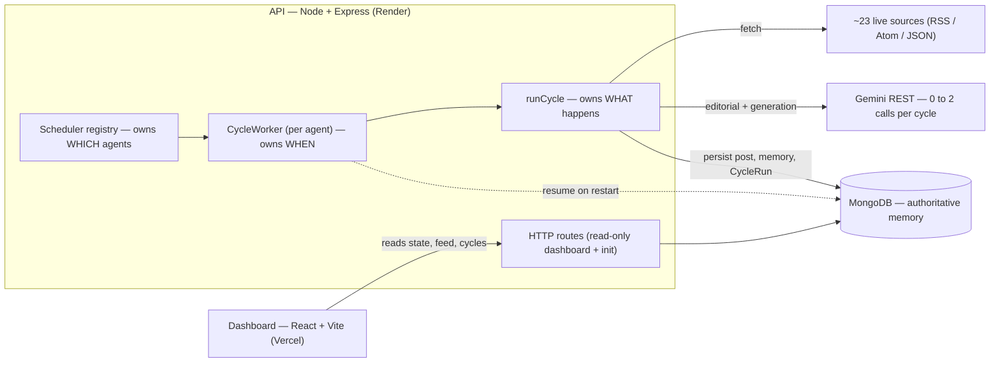
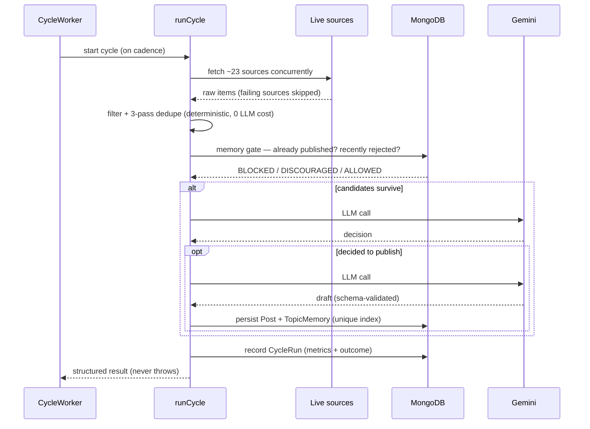

# Autora — Autonomous AI Creator

> **Most AI waits for a prompt. Autora decides when it should act.**

Autora is an autonomous AI agent that discovers technology topics from live sources, decides on
its own whether each one is worth publishing, writes it up in a consistent editorial voice, and
remembers what it already said — all on a background schedule, with **no human prompting between
cycles**. You initialize it once; from then on it runs itself.


Autora ships with no hard-coded persona: the architecture accepts any persona supplied through
`POST /api/agent/init`. The walkthrough below uses an AI-security researcher as its example.

> Autora began as a hackathon build (an autonomous AI content-creator brief) and has since been
> hardened into a portfolio project. The autonomous behavior described below is real and running,
> not a scripted demo.

---

## Live demo

<!-- Paste your deployed URLs here. -->

- **Dashboard (frontend):** _add your Vercel URL_
- **API health (backend):** _add your Render URL_`/api/health`

> The backend is hosted on a free tier that sleeps when idle, so the **first request after a period
> of inactivity can take ~30–60s to cold-start**. Subsequent requests are fast. If the dashboard
> looks empty on first load, give the API a moment and refresh.

---

## Why this isn't just a chatbot

A normal LLM application is reactive: a human has to ask before anything happens.

| | Reactive AI (a chatbot) | Autora (autonomous) |
| --- | --- | --- |
| **Trigger** | A human prompt | Its own schedule — a background worker |
| **Decides *what* to cover** | The human | The agent, from live sources it discovered |
| **Decides *whether* to act** | Always answers | Can decline to publish; skipping is a valid outcome |
| **Memory** | Usually per-conversation | Persistent — it won't repeat itself across cycles |
| **Cost control** | One call per message | A hard budget of 0–2 model calls per cycle |

The hard part isn't generating text — LLMs do that on demand. The hard part is everything *around*
the generation: deciding **when** to run, **what** is worth covering, **whether** to publish at
all, and **not repeating** past work — reliably, unattended, and without burning API quota on
every cycle. That machinery is the project.

## The autonomous loop

You call `POST /api/agent/init` once with a persona. Nothing else is ever called. From that moment
a background worker runs the agent on its own schedule, and each cycle it:

1. **Discovers** — fetches **~23 live** RSS/Atom/JSON sources concurrently (security blogs, vendor
   advisories, arXiv, Hacker News). A failing source is logged and skipped, never fatal.
2. **Filters and deduplicates locally** — drops stale, low-quality, and off-domain items, then
   removes duplicates by URL, normalized title, and topic similarity (a 3-pass dedupe). All
   deterministic, **zero LLM cost**. A busy cycle narrows a large raw pool down to **at most 8**
   candidates (`EDITORIAL_MAX_CANDIDATES`, default 8).
3. **Checks memory** — topics it already published are `BLOCKED` and dropped *before* any model
   call. Recently rejected topics are `DISCOURAGED` — still judged, just weighted down.
4. **Decides** (LLM call #1) — the model is shown the surviving candidates and the persona's
   editorial standards and answers: publish one, or publish nothing. **Choosing to publish nothing
   is a legitimate outcome**, recorded as a deferral, not treated as an error.
5. **Writes** (LLM call #2, *only* if it decided to publish) — generates the post, which is
   validated against a schema before anything is stored.
6. **Publishes** — persists the post to MongoDB behind a uniqueness index, so the same topic cannot
   be published twice even under concurrency. *(Publishing here means storing a durable, feed-served
   post — see [Limitations](#limitations).)*
7. **Remembers** — records the decision (published / deferred / rejected) so the next cycle behaves
   differently, writes a structured `CycleRun` history row, and optionally mirrors a strategic
   episode into the optional strategic-memory layer.

`GET /api/agent/feed` only ever *reads* what the worker already stored. It never generates content
on request — the autonomy is real, not lazily triggered by the reader.

```
LIVE SOURCES -> COLLECTOR -> LOCAL FILTER -> DEDUPE -> SCORING -> CANDIDATES
    -> MEMORY GATE -> AI EDITORIAL JUDGE -> SELECTED TOPIC -> AI WRITING
    -> VALIDATION -> MONGODB -> FEED API -> DASHBOARD
```

### Who decides *when*: the scheduler

Autonomy is a scheduling problem as much as a content problem. Three layers split the concern:

- **Scheduler** (registry) — owns **which** agents exist and are runnable.
- **CycleWorker** (one per agent) — owns **when** a cycle fires. It runs independent of HTTP,
  refuses overlapping cycles for the same agent, applies **exponential backoff** (capped at 30 min)
  on real failures, and **resumes agents on process restart** with a stagger so a redeploy doesn't
  stampede every agent at once.
- **`runCycle`** — owns **what** happens in a cycle (the 7 steps above). It never throws at the
  scheduler; every result comes back structured.

## Architecture



One cycle, end to end:



## Key engineering decisions

- **Deterministic work before any model call.** Fetching, filtering, dedupe, scoring, and the
  memory gate are plain code. The LLM is reached only after the cheap work has narrowed the field —
  so a cycle that has nothing new to say costs **zero** model calls.
- **A hard LLM budget of 0, 1, or 2 calls per cycle.** Call #1 is the editorial decision; call #2
  is generation, and only happens on the publish path. This bounds token spend per cycle by design,
  not by luck.
- **MongoDB is the real duplicate guarantee.** A **partial unique index** on
  `{agentId, normalizedTopic}`, scoped to published decisions, means the database rejects a
  duplicate publish even under concurrent cycles — the guarantee doesn't depend on application-level
  checks winning a race.
- **`CycleRun` — durable, structured cycle history.** Every cycle writes an idempotent history row
  (unique `cycleId`) capturing its outcome and metrics, exposed at `GET /api/agent/:agentId/cycles`
  with cursor pagination. Its metrics **default to `null`, never `0`** — "not recorded" and "recorded
  as zero" are different facts, and the UI is built to tell them apart. Interrupted runs are marked
  on the next startup rather than left dangling.
- **No payloads in history.** `CycleRun` stores what happened, not the generated content — the Post
  collection is the single source of truth for output.

## Memory model

- **MongoDB is authoritative.** Duplicate prevention and repetition detection are backed by
  persisted records, not process memory — so they survive restarts and redeploys.
- **The repetition gate has three verdicts.** `BLOCKED` (already published — dropped before any LLM
  call), `DISCOURAGED` (recently rejected — still eligible, weighted down), and `ALLOWED`.
- **Strategic memory is optional and non-authoritative.** A cross-cycle recall layer can be layered
  on top via REST (not an LLM). Disabled, unkeyed, or unreachable, the agent behaves exactly as it
  did before the feature existed: it can never fail a cycle, trigger backoff, block publishing, or
  override a deterministic decision. It is **disabled by default**.

## Failure handling

Failures are surfaced honestly, never hidden:

- **Provider quota / rate limits (429).** A quota error **degrades the cycle into a skip** rather
  than crashing it. The agent tries again on its next cadence; repeated failures trigger exponential
  backoff.
- **Source outages.** A failing source is logged and skipped. If *every* source fails, the cycle
  simply has nothing to work with and publishes nothing — still not a crash.
- **Strategic-memory outages are non-fatal by construction** (see above).
- **Process restarts.** On boot, the scheduler resumes runnable agents and marks any cycle that was
  mid-flight as interrupted, so history stays truthful across redeploys.
- **`runCycle` never throws at the scheduler.** Every failure returns as a structured result the
  worker can reason about.

## Example cycle

A concrete run (illustrative values):

1. **Discover** — 23 sources fetched; 4 fail (an advisory feed 500s, an HTML login page isn't a
   feed). The rest return a few hundred items.
2. **Filter + dedupe** — stale, off-domain, and low-quality items drop; three near-duplicates
   collapse. ~8 candidates survive, deterministically.
3. **Memory gate** — one candidate matches a topic published last week → `BLOCKED`, dropped before
   any model call.
4. **Editorial (call #1)** — the model weighs the survivors against the persona's editorial standards and decides
   *"publish nothing this cycle — none clears the bar."*
5. **Remember** — the deferral is recorded; a `CycleRun` row is written with outcome `idle` and the
   candidate counts. **Model calls this cycle: 1. Cost: bounded.**

The next cycle, a genuinely new prompt-injection disclosure arrives, clears the editorial bar,
generation runs (call #2), the post is schema-validated, persisted behind the unique index, and the
topic is remembered so it's never republished.

## Screenshots

<!-- Screenshot files are added under assets/ in a later pass; this section describes them so the
     README reads fully on its own until the images land. -->

- **Overview** — the live loop status, historical performance, recent autonomous runs, latest posts.
- **Autonomous loop** — the per-cycle pipeline trace with per-stage timing and outcome.
- **Cycle detail** — a single cycle's timeline, decision, output, and any failures.
- **System health** — the five subsystems (API, MongoDB, LLM provider, scheduler, strategic memory),
  each with an honest verdict (including "unknown" when the dashboard hasn't heard from one).

## Tech stack

| Layer      | Choice                                                                 |
| ---------- | ---------------------------------------------------------------------- |
| Runtime    | Node.js 20+ (developed on 25.x), ES modules                            |
| Backend    | Express 5.1                                                            |
| Database   | MongoDB via Mongoose 9.9 (MongoDB Atlas)                               |
| LLM        | Google Gemini via the REST API — called directly with `fetch`, no SDK  |
| Frontend   | React 19.2 + Vite 8.2 + Tailwind CSS 4.3                               |
| Tests      | Built-in `node:test` + `mongodb-memory-server` (no test framework dep) |
| Extra      | Optional strategic memory (REST), plain `fetch` for all HTTP           |

Server production dependencies are only `cors`, `dotenv`, `express`, and `mongoose`. The client
ships only `react` and `react-dom`. No LLM SDK, no HTTP client library, no router.

## Requirements

- Node.js 20+
- A MongoDB connection string (MongoDB Atlas free tier is fine)
- A Google Gemini API key (or run with `LLM_PROVIDER=mock`)

## Local setup

```bash
npm run install:all
```

Create your local env file from the template and fill in real values:

```bash
cp .env.example server/.env
```

`server/.env` is gitignored. Never commit real keys.

Then run the two processes in separate terminals:

```bash
npm run dev:server
```

```bash
npm run dev:client
```

- API: http://localhost:5000
- Dashboard: http://localhost:5173

The Vite dev server proxies `/api` to the backend, so no CORS setup is needed locally.

Check the backend directly:

```bash
curl http://localhost:5000/api/health
```

Start the agent (this is the only call you ever have to make):

```bash
curl -X POST http://localhost:5000/api/agent/init -H "Content-Type: application/json" -d "{\"persona\":{\"name\":\"Autora\",\"domain\":\"AI Security\"}}"
```

> No MongoDB handy? Set `USE_EPHEMERAL_DB=true` to spin up an in-memory database for **local
> testing only**. It is explicitly rejected in production — it is never a silent fallback for a
> missing `MONGODB_URI`.

## Environment variables

Names and placeholders only — see [.env.example](.env.example) for the annotated template.
Never commit real values.

| Variable                  | Required | Purpose                                                                     |
| ------------------------- | -------- | --------------------------------------------------------------------------- |
| `MONGODB_URI`             | yes (prod) | MongoDB connection string. Required in production; startup fails without it |
| `USE_EPHEMERAL_DB`        | no       | In-memory DB for local testing only. Rejected in production                 |
| `DNS_SERVERS`             | no       | Comma-separated resolvers, only if your network cannot answer `mongodb+srv` SRV lookups |
| `LLM_PROVIDER`            | no       | `gemini` or `mock` (default `gemini`)                                        |
| `LLM_API_KEY`             | yes      | API key for the selected provider. Fatal in production if unset with `gemini` |
| `LLM_MODEL`               | no       | Model id (default `gemini-3.6-flash`)                                        |
| `AGENT_MODE`              | no       | `demo` or `production` — cadence only, same pipeline                         |
| `AGENT_CYCLE_INTERVAL_MS` | no       | Explicit cycle cadence in ms, overriding the mode default. See below         |
| `AGENT_MAX_BACKOFF_MS`    | no       | Ceiling for failure backoff (default 30 minutes)                             |
| `EDITORIAL_MAX_CANDIDATES`| no       | Max candidates sent to the editorial call, 1–10 (default `8`)                |
| `BREETH_ENABLED`          | no       | Enables the optional strategic-memory layer (disabled by default)           |
| `BREETH_API_KEY`          | no       | Strategic memory: server-side only. Never exposed to the client              |
| `BREETH_TIMEOUT_MS`       | no       | Strategic-memory request timeout (default `3000`)                            |
| `PORT`                    | no       | Backend port (default `5000`)                                                |
| `NODE_ENV`                | no       | `development` or `production`                                                |
| `CORS_ORIGIN`             | no       | Comma-separated allowed browser origins                                      |
| `VITE_API_BASE_URL`       | no       | Client-side. Deployed backend origin; leave empty locally                    |

*(The `BREETH_*` variables keep their literal names because that is the strategic-memory provider's
prefix; in the product UI the layer is labelled "Strategic memory.")*

## Agent modes and cadence

Both modes run the **same** autonomous pipeline against the same live sources. Only the cadence
differs — demo mode does not fabricate posts.

| `AGENT_MODE` | Default cycle interval | Use                           |
| ------------ | ---------------------- | ----------------------------- |
| `demo`       | ~45 seconds            | Live demonstrations           |
| `production` | ~6 hours               | The 48-hour evaluation window |

`AGENT_CYCLE_INTERVAL_MS` overrides either default. It exists because the mode defaults are tuned
for visibility, not for provider quota: at 45 seconds the agent asks for ~1,920 editorial calls a
day, while a free-tier Gemini key allows 20 per model per day. Rough guide:
`86,400,000 / your daily call allowance` — about `4320000` (72 minutes) for a 20/day tier. The
value must be a positive integer of at least `1000`; an unparseable value is a startup error, never
a silent fall back to 45 seconds.

## API contract

`POST /api/agent/init`

```json
{ "persona": { "name": "Ada", "domain": "AI Security" } }
```

Returns `{ "agentId": "agt_..." }`. Idempotent per persona — the database, not the handler, is the
arbiter, so concurrent inits cannot both win.

`GET /api/agent/feed?agentId=agt_...`

Returns `{ "posts": [...] }` — newest first, unique ids, ISO 8601 UTC timestamps, and a `rationale`
plus `sources` on every post. An agent with no posts yet returns `{ "posts": [] }`.

Read-only dashboard endpoints:

| Endpoint                             | Returns                                            |
| ------------------------------------ | -------------------------------------------------- |
| `GET /api/health`                    | Liveness + database ping + redacted config         |
| `GET /api/agent`                     | All agents                                         |
| `GET /api/agent/:agentId`            | One agent's state and stats                        |
| `GET /api/agent/:agentId/activity`   | Recent cycle activity                              |
| `GET /api/agent/:agentId/memory`     | Topic memory rows                                  |
| `GET /api/agent/:agentId/cycles`     | Structured `CycleRun` history, cursor-paginated    |

## Deployment

The backend and frontend deploy as two separate services.

**Backend** (Render, Railway, Fly.io, or any Node host):

- Root directory: `server`
- Build command: `npm install`
- Start command: `npm start` (runs `node src/server.js`)
- Health check path: `/api/health` — returns `503` when the database is unusable, so the host can
  distinguish "process alive" from "actually able to serve"
- Required environment variables: `MONGODB_URI`, `LLM_API_KEY`, `NODE_ENV=production`,
  `AGENT_MODE=production`, and `CORS_ORIGIN` set to the deployed frontend origin.
  Optionally `LLM_MODEL`, `AGENT_CYCLE_INTERVAL_MS`, and the `BREETH_*` variables.
- MongoDB Atlas: allow the host's outbound IPs (or `0.0.0.0/0` for a free-tier demo) in Network
  Access, or the connection will hang rather than fail clearly.
- The scheduler starts with the process and resumes existing agents automatically — do **not**
  deploy more than one always-on instance, or agents would cycle twice.

**Frontend** (Vercel, Netlify, or any static host):

- Root directory: `client`
- Build command: `npm run build`
- Output directory: `dist`
- Environment variable: `VITE_API_BASE_URL` = the deployed backend origin (e.g.
  `https://your-api.onrender.com`). It is baked in at build time, so set it before building.

After both are live, set `CORS_ORIGIN` on the backend to the frontend URL, redeploy the backend,
then call `POST /api/agent/init` once against the deployed API to start the autonomous loop.

## Testing

```bash
# from the repo root
cd server && npm test      # 690 tests
cd client && npm test      # 44 tests
```

**690 server-side tests and 44 client-side tests (734 total), all passing.** The server suite runs
on the built-in `node:test` runner against an in-memory MongoDB (`mongodb-memory-server`) — no extra
test framework dependency, no network calls, no provider quota spent. The client suite covers the
pure derivation layers (health verdicts, cycle history joins, formatting) with `node:test`.

## Limitations

Stated plainly, because an honest scope is part of the engineering:

- **Publishing means persisting a durable post to MongoDB that the feed serves — not posting to a
  real social network.** The pipeline that decides *whether* and *what* to publish is real; the
  final delivery target is the app's own store, and real publishing connectors are future work.
- **Single LLM provider.** Autora calls Google Gemini directly. It degrades gracefully on quota /
  rate-limit errors (a cycle skips rather than crashing), but there is no automatic provider
  failover — Gemini's own availability and quota bound how often the agent can publish.
- **The activity log is an ephemeral, process-local ring buffer.** The dashboard's recent-activity
  feed lives in process memory (a bounded ring) and resets on restart. Durable history lives in
  `CycleRun`, the posts, and topic memory — those persist.
- **The 5-subsystem health view is a client-side derivation.** The backend exposes `GET /api/health`
  (liveness + DB ping) and the raw activity/agent state; the "five subsystems, five verdicts" view is
  computed in the client from those signals, not returned as a single server-side health object.
- **Single-agent runtime in practice.** The data model and scheduler support multiple agents, but
  deployments run one always-on instance with one active agent.

## Future improvements

- Automatic multi-provider LLM failover (fall back to another model/provider on sustained quota
  errors).
- Real publishing connectors (e.g. a headless CMS, or a social API) behind the same decision layer.
- A persisted activity log so recent-activity survives restarts.
- Multi-agent operation with per-agent dashboards.

## Project layout

```
server/
  src/
    config/       env loading, validation, redacted public config
    controllers/  request handlers
    routes/       express routers
    models/       mongoose schemas (agent, post, topic memory, cycle run)
    services/
      llm/        provider abstraction (gemini, mock), retry, usage tracking
      sources/    live source adapters, normalized output
      topics/     filtering, dedupe, scoring, candidate selection
      editorial/  the publish-or-skip decision
      generation/ post writing and schema validation
      publisher/  the guarded write to MongoDB
      memory/     topic recall and repetition detection
      breeth/     optional strategic memory (isolated, never fatal)
      agent/      runCycle — the composed autonomous cycle
    scheduler/    background worker and lifecycle, independent of HTTP
    utils/        logger with activity buffer, agent events
    app.js        express app factory
    server.js     process bootstrap and signal handling
  test/           node:test suites
client/
  src/
    components/   dashboard UI pieces
    hooks/        polling hooks
    lib/          pure derivation + formatting helpers
    services/     API client
  test/           node:test suites
```

## Documentation

- [ARCHITECTURE.md](ARCHITECTURE.md) — system architecture and design decisions
- [PROMPTS.md](PROMPTS.md) — the major AI prompts used to build this project
- [PROJECT_HANDOFF.md](PROJECT_HANDOFF.md) — phase-by-phase build record
- [.env.example](.env.example) — annotated environment template

## License

[MIT](LICENSE) © Krishna Kumar Barnwal
